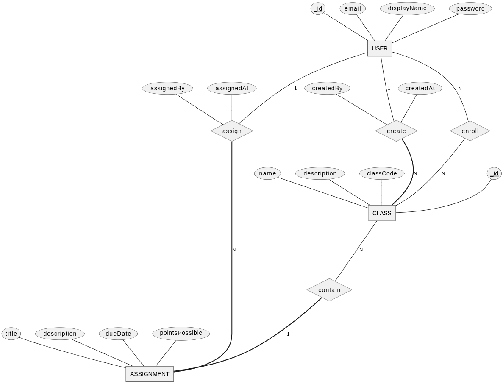
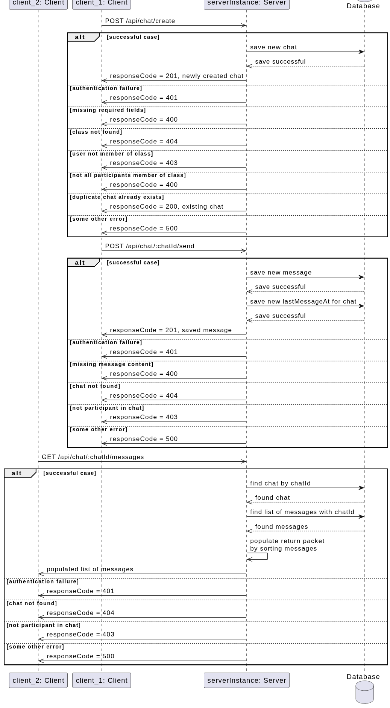

# Welcome!
This is our repo for our CS35L final project (Group 45). To start off:
- Read through this README (setup steps are below)
- Read through [client/README.md](client/README.md) for end-to-end testing information
- Read through [server/docs/README.md](server/docs/README.md) for information on how to run and test the backend

# READ ME BEFORE YOU PUSH!!!
We have a GitHub Project set up to track our progress throughout the course of this project. Please utilize it by doing the following:
- **Do NOT push to `main`!!!**
- Doing all your development work on a branch (for example, I created the branch `example-branch` for this commit)
  - If you want, you can name your branch either on the feature you're currently implementing (e.g. `frontend-authentication` or `hotfix`), or you can name it after your username (e.g. `siphc`) and keep the branch after merging.
- Submitting a [Pull Request](https://github.com/siphc/cs35l-final-project/pulls) to `main` from your branch after your commit and push to **your branch** (for example, `origin/example-branch` for this commit)
  - Specify the [Issue](https://github.com/siphc/cs35l-final-project/issues) you are addressing with your PR. Your PR should more or less resolve the entire issue.
- Ask a team member to review your PR (which should include testing) and **squash-merge** the PR. This combines all the relevant commits into one commit which takes the name of the PR, so give your PRs a meaningful name. We do this to avoid cluttering.
- The Project automation is set up such that if you merge a PR that closes an Issue affiliated with a Project Item, the Item is automatically marked as done.

# Setup steps
Clone the directory:
```
git clone git@github.com:siphc/cs35l-final-project.git
```
### Frontend
After cloning the directory, run:
```
cd cs35l-final-project/client/
npm install
```
To install the Node.js package dependencies.

To test the web application, run:
```
npm run dev
```

When you're ready to bring the system live, run:
```
npm start
```

### Backend
Navigate to the `server/` directory, and run:
```
npm install
cp .env.example .env
```

To run the server, run:
```
npm start
```

To run unit tests, run:
```
npm test
```

# Diagrams


# DISCLAIMER

## GenAI Usage
Claude Code, an agentic LLM-based coding tool, was used in the development of the frontend, especially with regards to its aesthetics. Prompts used, as well as a list of files that were changed, are listed below. The changes can be seen in commit 9e1e565, "fix: UI improvements (#23)". Note that this commit contains both human-written fixes (such as in login.jsx and register.jsx) and human-written features (such as in calendar.jsx). The influence of LLMs is mostly limited to CSS.
```
1. Analyze this repository and create a comprehensive CLAUDE.md file that explains the codebase structure, development workflows, and key conventions for AI assistants to follow. If one already exists, update it with the most recent state

---

2. Add this to CLAUDE.md:

DISTILLED_AESTHETICS_PROMPT = """ <frontend_aesthetics> You tend to converge toward generic, "on distribution" outputs. In frontend design, this creates what users call the "AI slop" aesthetic. Avoid this: make creative, distinctive frontends that surprise and delight. Focus on:

Typography: Choose fonts that are beautiful, unique, and interesting. Avoid generic fonts like Arial and Inter; opt instead for distinctive choices that elevate the frontend's aesthetics.

Color & Theme: Commit to a cohesive aesthetic. Use CSS variables for consistency. Dominant colors with sharp accents outperform timid, evenly-distributed palettes. Draw from IDE themes and cultural aesthetics for inspiration.

Motion: Use animations for effects and micro-interactions. Prioritize CSS-only solutions for HTML. Use Motion library for React when available. Focus on high-impact moments: one well-orchestrated page load with staggered reveals (animation-delay) creates more delight than scattered micro-interactions.

Backgrounds: Create atmosphere and depth rather than defaulting to solid colors. Layer CSS gradients, use geometric patterns, or add contextual effects that match the overall aesthetic.

Avoid generic AI-generated aesthetics:

    Overused font families (Inter, Roboto, Arial, system fonts)
    Clichéd color schemes (particularly purple gradients on white backgrounds)
    Predictable layouts and component patterns
    Cookie-cutter design that lacks context-specific character

Interpret creatively and make unexpected choices that feel genuinely designed for the context. Vary between light and dark themes, different fonts, different aesthetics. You still tend to converge on common choices (Space Grotesk, for example) across generations. Avoid this: it is critical that you think outside the box! </frontend_aesthetics> """

---

3. As a user, I want the UI to be appropriate for a modern Digital Classroom Platform. Redesign the frontend UI so that it reflects the design principles. Feel free to remove redundant/deprecated CSS declarations in order to reduce bloat and improve readability.

---

4. The <h1>Digital Classroom Platform</h1> is not centered and persists across pages. I would like it to be centered and appear only in the login and register pages. Keep in mind: .login-container and .register-container are relatively small boxes compared to the rest of the screen, and I would like the title to appear outside of the box. Before you start coding, answer: how would you go about solving this issue?

---

5. The <h1> element is in app.jsx. start coding.

---

6. Make the color palette UCLA themed

---

7. Pull the most recent merge commit. There is an error with the login and register page, where most of the content is restricted to the left part of the page. I have attached a screenshot for reference. Read what has changed since your last commit, and fix this issue.
```

Changes made:
- **CLAUDE.md** (I asked it to generate its own, per prompt 1)
- Every **\*.css** file (for design purposes)
- **client/src/app.jsx** (added conditional rendering for an element per prompt 4 & 5)